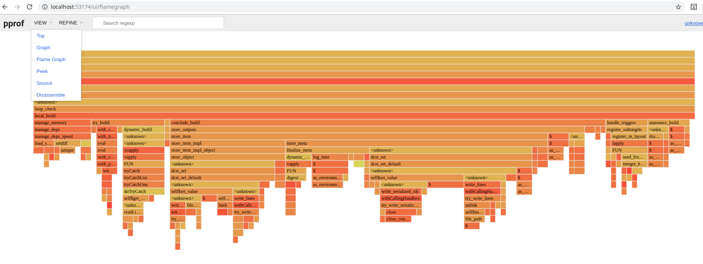

# Profiling studies

The goal is to identify and reduce `drake`'s overhead.

# Requirements

- Packages in `R/packages.R`.
- [`RProtoBuf`](https://github.com/eddelBuettel/RProtoBuf)
- [Go](https://golang.org)
- [`pprof`](https://github.com/google/pprof)

# Usage

1. Run one of the workflow scripts in the section below.
2. Look for the URL in the console messages, e.g. `local pprof server: http://localhost:50982`.
3. Navigate a browser to the URL you found, e.g. `http://localhost:50982`.
4. Navigate to the flame graph ("view" menu on the upper left) and look for bottlenecks. Click and hover to interact with the graph.

# Workflows

- `connected.R`: a plan with a highly connected graph.
- `makefile.R`: like `connected.R`, but with a `Makefile` instead of `drake`.
- `dynamic.R`: dynamic branching with many sub-targets.
- `static.R`: static branching comparison for `dynamic.R`.
